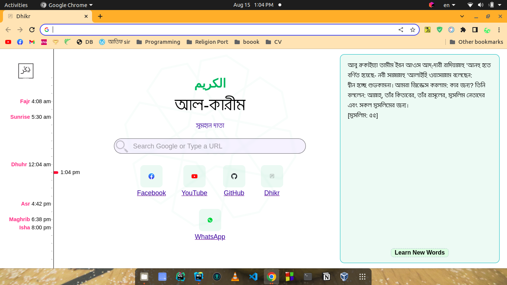
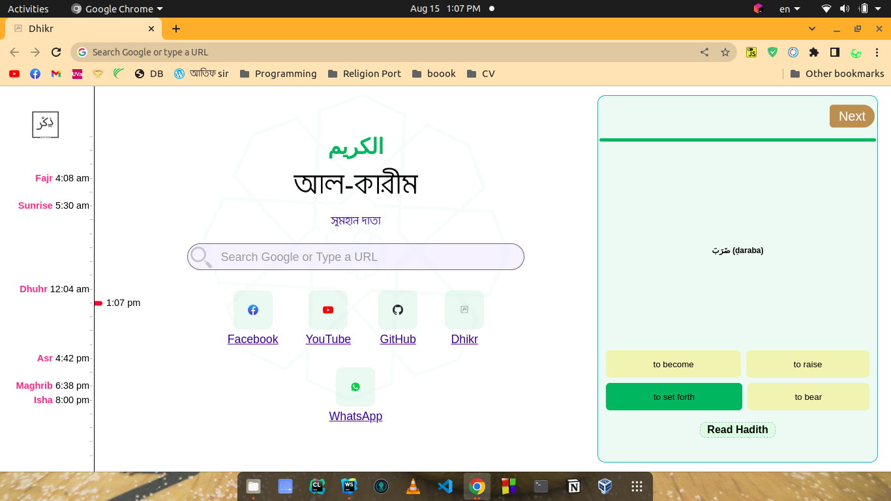

# Dhikr
## Google chrome extension

 
فَٱذْكُرُونِىٓ أَذْكُرْكُمْ وَٱشْكُرُواْ لِى وَلَا تَكْفُرُونِ

_So remember Me and I shall remember you; give thanks to Me and do not be ungrateful to Me for My favours. (2:152)_

### Read a Hadith, Learn a new word whenever you open a new tab

# Prerequisites
1. Node.js ^14
# How to run Dhikr
1. `git clone https://github.com/NHSanto/dhikr.git`

2. `npm i`
3. `npm start`

# Dhikr Installation
Go to this [link](https://chrome.google.com/webstore/detail/dhikr-chrome-extension/alhhipkdolifadffnollpkijfpnlnfka/related?authuser=1) and install Dhikr as your chorme extension.