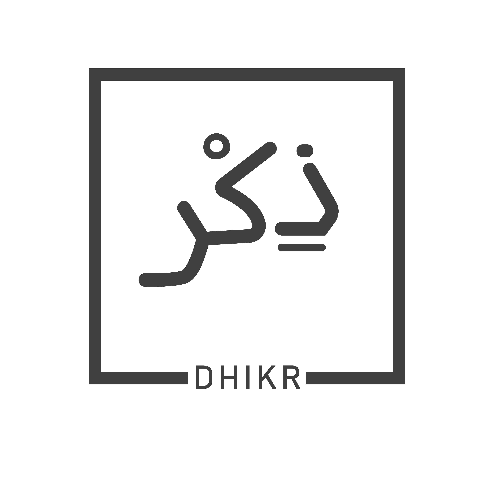

A small companion of your daily dhikr while you work or surf internet. Recite Tasbih everytime you open a new tab.


## Installation
**Browser Extensions**
- Google Chrome: https://chrome.google.com/webstore/detail/dhikrxyz/alhhipkdolifadffnollpkijfpnlnfka
- Firefox: https://addons.mozilla.org/en-US/firefox/addon/dhikr/

## Tasbih Representation
All the Tasbihs listed as below in `data.json`:
```
{
    "SL": 1,
    "ARABIC": "فَاذْكُرُوْنِيْٓ اَذْكُرْكُمْ وَاشْكُرُوْا لِيْ وَلَا تَكْفُرُوْنِ",
    "BANGLA_UCCHARON": "ফাযকুরুনি আযকুরুকুম ওয়াশকুরুলি ওয়ালা তাকফুরুন",
    "BANGLA_ORTHO": "“অতএব তোমরা আমাকে স্মরণ কর, আমিও তোমাদেরকে স্মরণ করব। আর তোমরা আমার প্রতি কৃতজ্ঞতা প্রকাশ কর এবং আমার প্রতি অকৃতজ্ঞ হয়ো না।”"
}
```


## Reference
- https://github.com/junaidkbr/zikrrr
